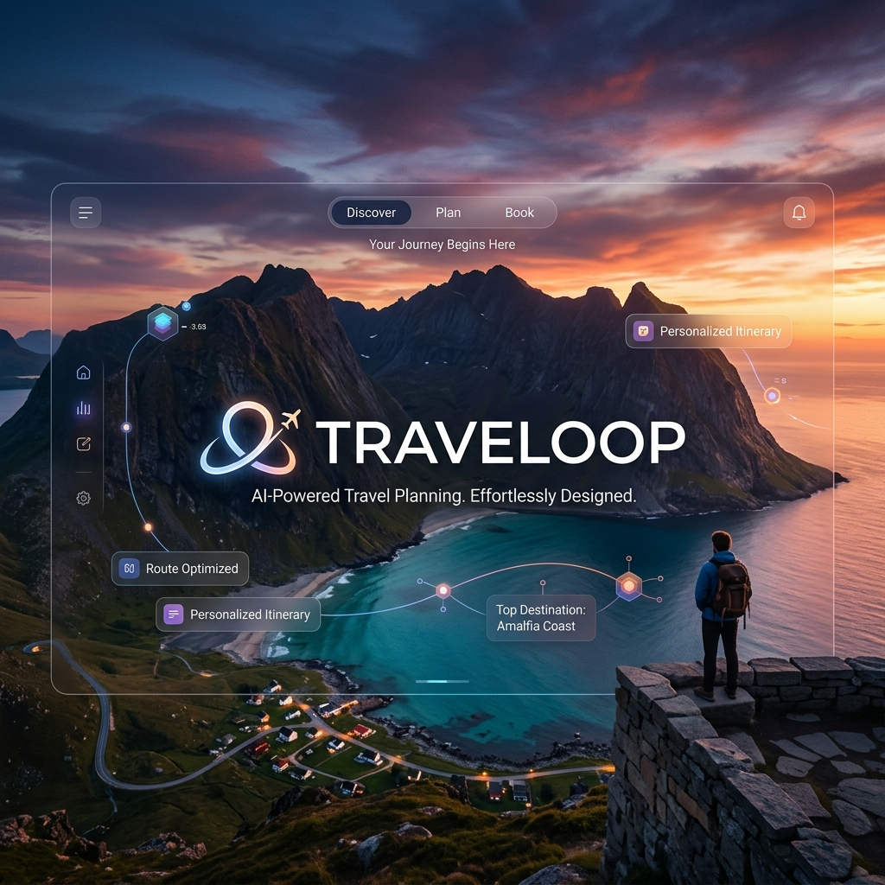
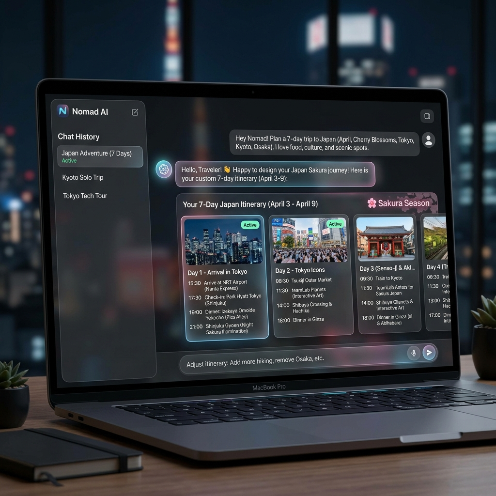
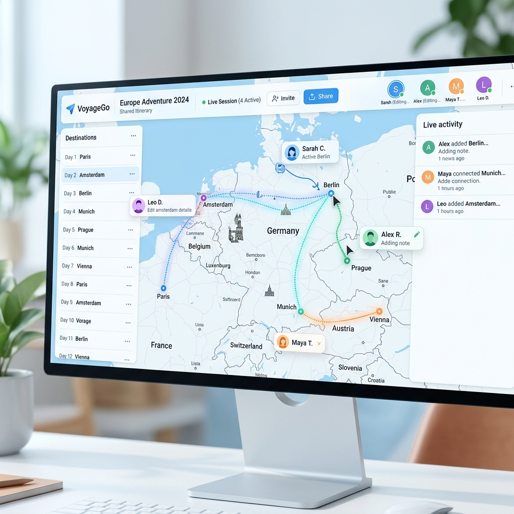
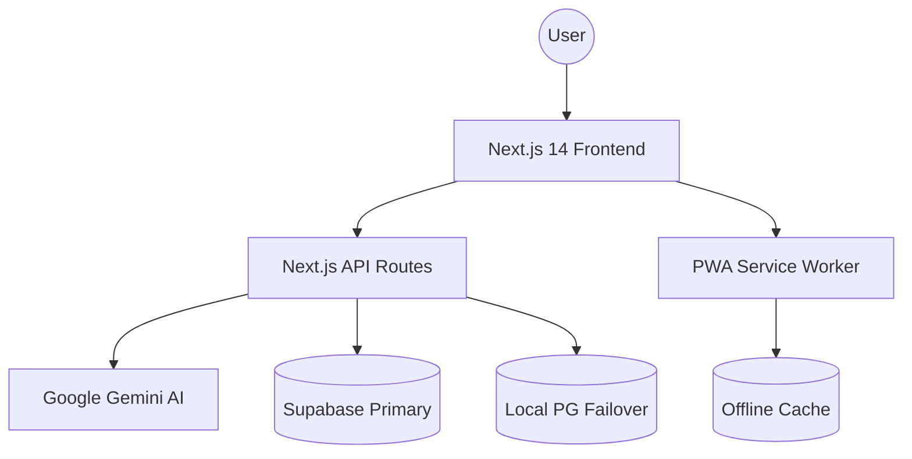

<div align="center">
  

  # ✈️ Traveloop
  ### AI-Powered Collaborative Travel Planner
  
  [](https://nextjs.org/)
  [](https://www.typescriptlang.org/)
  [](https://tailwindcss.com/)
  [](https://www.prisma.io/)
  [](https://web.dev/progressive-web-apps/)

  <p align="center">
    <b>Traveloop</b> is a production-ready SaaS platform that centralizes travel planning into a single unified workspace. Leverage the power of <b>Google Gemini AI</b> to generate dream itineraries, collaborate with friends in real-time, and stay organized even when you're 30,000 feet in the air.
  </p>

  <a href="#-key-features">Key Features</a> •
  <a href="#-tech-stack">Tech Stack</a> •
  <a href="#-getting-started">Getting Started</a> •
  <a href="#-architecture">Architecture</a> •
  <a href="#-pwa-support">PWA</a>
</div>

<hr />

## 📊 Project Status

**Current Version:** `0.1.0 (Alpha)`
**Progress:**
<br />


- [x] AI Core Integration
- [x] Real-time Collaboration Engine
- [x] PWA Offline Support
- [/] Advanced Budgeting (In Progress)
- [ ] Receipts OCR Implementation
- Live Link : "https://traveloop-smoky.vercel.app/"


## ✨ Key Features

<table width="100%">
  <tr>
    <td width="50%">
      <h3>🤖 AI-Powered Itineraries</h3>
      <p>Transform your travel ideas into detailed day-by-day plans. Using <b>Google Gemini 2.0 Flash</b>, Traveloop suggests the best spots, restaurants, and activities based on your preferences.</p>
    </td>
    <td width="50%">
      
    </td>
  </tr>
  <tr>
    <td width="50%">
      
    </td>
    <td width="50%">
      <h3>🤝 Real-Time Collaboration</h3>
      <p>Planning a group trip? Invite your friends to your workspace. Watch edits happen live, vote on activities, and split the budget without the "where should we go" headache.</p>
    </td>
  </tr>
</table>

- **📱 Offline-First PWA:** Your itineraries are always with you. Access maps, bookings, and plans even without an internet connection.
- **💰 Smart Budgeting:** Track expenses in real-time with automated category breakdown and cost estimation.
- **🌍 Community Templates:** Discover and duplicate itineraries from the world's most experienced travelers.
- **⚡ Performance First:** Built with Next.js 14 and optimized for speed, ensuring a buttery-smooth experience on any device.

<hr />

## 🛠️ Tech Stack

### Frontend & UI
- **Core:** [Next.js 14](https://nextjs.org/) (App Router)
- **Styling:** [Tailwind CSS](https://tailwindcss.com/)
- **Components:** [Shadcn/UI](https://ui.shadcn.com/) & [Radix UI](https://www.radix-ui.com/)
- **Animations:** [Framer Motion](https://www.framer.com/motion/)
- **Icons:** [Lucide React](https://lucide.dev/)

### Backend & AI
- **Runtime:** [Node.js](https://nodejs.org/)
- **Database:** [Supabase](https://supabase.com/) & [Prisma ORM](https://www.prisma.io/)
- **AI:** [Vercel AI SDK](https://sdk.vercel.ai/) with [Google Gemini](https://deepmind.google/technologies/gemini/)
- **Caching:** [TanStack Query](https://tanstack.com/query/latest)

### DevOps & Tools
- **Deployment:** [Vercel](https://vercel.com/)
- **Email:** [Nodemailer](https://nodemailer.com/)
- **Validation:** [Zod](https://zod.dev/)
- **State:** [Zustand](https://github.com/pmndrs/zustand)

<hr />

## 🚀 Getting Started

### 1️⃣ Clone & Install
```bash
git clone https://github.com/your-username/traveloop.git
cd traveloop
npm install
```

### 2️⃣ Environment Configuration
Create a `.env` file in the root directory:
```env
DATABASE_URL="your-supabase-url"
DIRECT_URL="your-direct-url"
GOOGLE_GENERATIVE_AI_API_KEY="your-gemini-key"
NEXT_PUBLIC_SUPABASE_URL="your-supabase-project-url"
NEXT_PUBLIC_SUPABASE_ANON_KEY="your-anon-key"
```

### 3️⃣ Database Initialization
```bash
npx prisma db push
npm run seed
```

### 4️⃣ Launch Development Server
```bash
npm run dev
```
Navigate to `http://localhost:3000` to see your travel companion in action!

<hr />

## 🧪 Testing

Traveloop is built with a focus on reliability.

### Unit Tests
Execute unit tests using [Vitest](https://vitest.dev/):
```bash
npm run test
```

### E2E Tests
Run end-to-end flows with [Playwright](https://playwright.dev/):
```bash
npm run e2e
```

<hr />

## 🏗️ Architecture

Traveloop is designed for **resilience and scale**. 

- **Dual-Database Strategy:** Uses Supabase as the primary cloud provider with a local PostgreSQL fallback to ensure data availability during network outages.
- **Serverless API:** Leveraging Next.js API routes for a scalable, cost-effective backend.
- **Edge-Ready:** AI features are optimized for edge execution to reduce latency globally.

### 📐 System Overview


<hr />

## 📱 PWA Support

Traveloop is fully installable as a Progressive Web App. This means:
1. **Offline Access:** View your trips even in airplane mode.
2. **Push Notifications:** Stay updated on group changes.
3. **App-like Experience:** No browser chrome, just your travel workspace.

### How to Install
- **Desktop (Chrome/Edge):** Click the "Install" icon in the address bar.
- **Mobile (iOS):** Tap "Share" and select "Add to Home Screen".
- **Mobile (Android):** Tap the three dots and select "Install App".

<hr />

## 📂 Project Structure

```text
traveloop/
├── prisma/             # Database schemas and migrations
├── public/             # Static assets and PWA icons
├── src/
│   ├── app/            # Next.js App Router (Routes & Pages)
│   ├── components/     # Reusable UI components
│   ├── features/       # Domain-specific logic (Trips, AI, Budget)
│   ├── hooks/          # Custom React hooks
│   ├── lib/            # Shared utilities and configurations
│   ├── services/       # External API integrations
│   └── types/          # TypeScript definitions
└── tailwind.config.ts  # Design system configuration
```

<hr />

## 🛤️ Roadmap

- [ ] **Phase 1:** Core AI Planning & Collaboration (Completed ✅)
- [ ] **Phase 2:** Advanced Budget Analytics & Receipts OCR
- [ ] **Phase 3:** Interactive Map Exploration with Mapbox
- [ ] **Phase 4:** Mobile App (React Native) Integration

<hr />

## ❓ Troubleshooting & FAQ

<details>
<summary><b>Database connection issues?</b></summary>
Ensure your Supabase instance is active and the <code>DATABASE_URL</code> in <code>.env</code> is correct. If you're behind a firewall, check if port 5432 is open.
</details>

<details>
<summary><b>AI not responding?</b></summary>
Verify your <code>GOOGLE_GENERATIVE_AI_API_KEY</code>. Traveloop uses Gemini 2.0 Flash, so ensure your key has access to this model via Google AI Studio.
</details>

<details>
<summary><b>PWA not installing?</b></summary>
PWA requires HTTPS in production. For local testing, ensure you're accessing the app via <code>localhost</code> (which browsers treat as secure).
</details>

<hr />

<div align="center">
  <p>Built with ❤️ by the Traveloop Team</p>
  <p><i>Making every journey worth the loop.</i></p>
</div>
